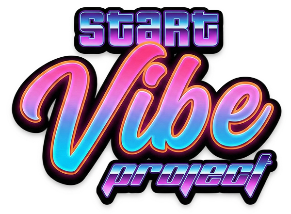

<p align="center">
	
</p>

# start-vibe-project

**start-vibe-project** is a CLI that bootstraps a new project with an AI-first documentation structure for **spec-driven development**. It creates a ready-to-fill `.project` workspace (about, specs, architecture, context, stories) so teams can align on requirements before writing code.

During setup you choose a template and stack, and the tool prepares agent directories and installs the required skills for your AI tool. The result is a clean, consistent starting point for OpenSpec-driven workflows.

## Quick Start

**Using bun (recommended)**

```bash
bunx start-vibe-project
```

**Using npm/npx**

```bash
npx start-vibe-project
```

## Features

- **Interactive setup**: Guided CLI prompts to configure your project
- **AI-first documentation**: Pre-structured `.project/` folder for AI agents
- **Multiple templates**: Web app, mobile app, API service, library, or empty project
- **Tech stack selection**: Choose frontend and backend frameworks
- **Multi-agent support**: Works with GitHub Copilot, Claude Code, Cursor, and more
- **Automatic skill installation**: Installs essential skills for your AI tool

## What Gets Created

```
my-project/
├── .project/
│   ├── INIT.md           # Project setup checklist for the creator agent
│   ├── about.md          # Project overview (pre-filled with your description)
│   ├── specs.md          # Technical specifications (with your stack choices)
│   ├── architecture.md   # System architecture (to be defined by agent)
│   ├── project-context.md # Living context document
│   └── stories/
│       └── stories.md    # User stories (to be defined)
├── .github/skills/       # Skills for your AI tool (or .claude/, .cursor/, etc.)
├── .github/agents/
│   └── creator.md        # Project Creator agent
├── .github/instructions/relief-pilot.instructions.md # Relief Pilot instructions (GitHub Copilot only, if enabled)
├── .github/copilot-instructions.md # Copilot instructions (if Relief Pilot is enabled)
├── .editorconfig         # Editor configuration
├── AGENTS.md             # Agent instructions
└── .gitignore
```

## Workflow

1. **Run the CLI**: `bunx start-vibe-project` (or `npx start-vibe-project`)
2. **Answer prompts**: Name, template, description, components, stack, AI tool
3. **Open in your AI tool**: VS Code with Copilot, Claude Code, Cursor, etc.
4. **Select `creator` agent**: The agent will continue project documentation
5. **Follow agent instructions**: Complete about.md, specs.md, architecture.md, stories

## Supported AI Tools (29)

- Claude Code
- Codex
- GitHub Copilot
- Cursor
- OpenCode
- ... and more supported

## Installed Skills

The following skills are automatically installed:

- **[project-creator](https://github.com/itechmeat/llm-code/tree/master/skills/project-creator)**: Project documentation scaffolding
- **[openspec](https://github.com/itechmeat/llm-code/tree/master/skills/openspec)**: OpenSpec artifact-driven workflow
- **[coderabbit](https://github.com/itechmeat/llm-code/tree/master/skills/coderabbit)**: AI code review
- **[commits](https://github.com/itechmeat/llm-code/tree/master/skills/commits)**: Conventional Commits specification
- **[changelog](https://github.com/itechmeat/llm-code/tree/master/skills/changelog)**: Keep a Changelog format
- **[skill-master](https://github.com/itechmeat/llm-code/tree/master/skills/skill-master)**: Create and edit Agent Skills
- **[social-writer](https://github.com/itechmeat/llm-code/tree/master/skills/social-writer)**: Social media content creation
- **[ask-questions-if-underspecified](https://github.com/trailofbits/skills/tree/main/plugins/ask-questions-if-underspecified/skills/ask-questions-if-underspecified)**: Prompts for clarifying requirements

## Templates

| Template | Description |
|----------|-------------|
| Web Application | Full-stack or frontend web application |
| Mobile Application | iOS, Android, or cross-platform mobile app |
| API Service | Backend REST or GraphQL API service |
| Library / Package | Reusable library or npm package |
| Empty Project | Blank project with just documentation structure |

## Development

#### Local testing (without publishing to npm)

Link the package globally:

```bash
bun link
```

Now you can run it from anywhere:

```bash
start-vibe-project my-test-project
```

Or run directly from source:

```bash
bun run dev
```

#### Unlink after testing

```bash
bun unlink start-vibe-project
```

#### Build

```bash
bun run build
```

## License

MIT
